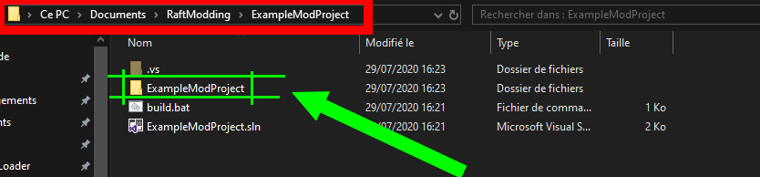

# How to create a mod project

Let's get started with the requirements! To get started modding you will need the following softwares :‌

* **​**[**Visual Studio Community**](https://visualstudio.microsoft.com/downloads/). We highly recommend you to download the 2019 version.
* \*\*\*\*[**Unity 2018.3.5f1**](https://unity3d.com/unity/whats-new/2018.3.5). If you have [UnityHub](https://public-cdn.cloud.unity3d.com/hub/prod/UnityHubSetup.exe) installed simply click [here](http://fastdl.raftmodding.com/downloadRaftUnityVersion.php).
* **​**[**dnSpy**](https://github.com/0xd4d/dnSpy/releases/latest). This is the latest available version.


**You have to use Unity 2018.3.5f1! Using another version is not supported!**


Now that you have the required softwares, let's create your mod project!‌

**1\)** Open the RMLLLauncher and create a mod project by using the mod creator as shown below.‌

**2\)** In the project name text field enter your mod name and hit **Create Project!** It will then tells you if it has succeeded and opens you the project folder as shown below.‌

**3\)** Now that your mod project is created you can open the **.sln** file, in the case above i open **ExampleMod.sln** with Visual Studio. After opening it, open the **.cs** file as shown below.‌

**4\)** Now that we created our mod project and opened it we can begin creating our mod! As you can see on the screenshot above, there is a lot of green lines, those are comments, read them to know what every line do. Now, let's create a shortcut of our project folder in our mods folder so we won't have to move files or build the mod each time we modify something in our mod. Yeah this is a great feature! 😁

The folder is by default located in _**Documents\RaftModding\YourProjectName\YourProjectName**_

Create a shortcut of this folder. **Its the folder that contains the`modinfo.json`file and the`.cs`file\(s\).** _The main folder should also work, but we highly recommend you to create a shortcut of the second one._‌

**6\)** Now, let's start the mod loader, Load our mod and open the console using F10 to see what's happening.‌

Just after loading the mod. The status change to green and says "Running...". Your mod is now running!‌

As you can see when you press F10 it executes the code in the Start\(\) method.‌

**7\)** Now that you know how to write code, to modify your mod information such as its description, its license, the icon, the banner etc simply go in to your mod project files and edit the **modinfo.json** file as shown below.‌

If you want to know more about this file, how to add an icon, what is the excludedFiles field etc, click below.[The modinfo.json file/modding-tutorials/how-to-create-a-mod-project/the-modinfo.json-file‌](the-modinfo.json-file.md)

**8\)** Now that you know how to write your mod and how to change its information to build it, simply generate the visual studio project and our build script will automatically pack/build your mod as shown below. The build script will generate a new file named `YourModName.rmod` This file is the mod file to upload on our [site](https://www.greenhellmodding.com/) and to put in the mods folder.‌

**And here it is! You made your first mod project! Keep in mind this tutorial is just the requirements & basics! More advanced tutorials are coming soon!**

