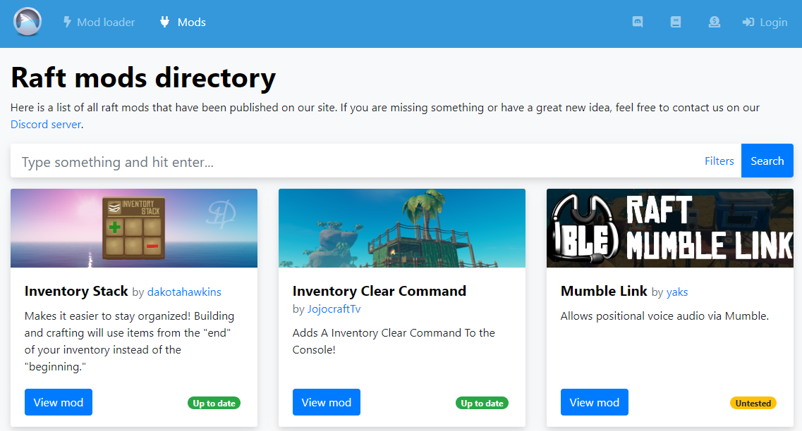
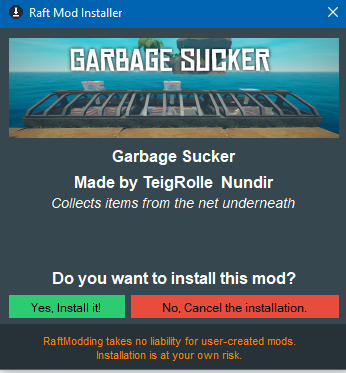
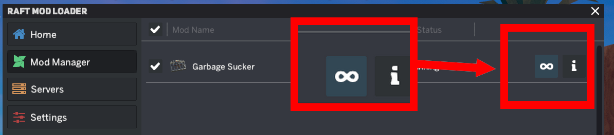
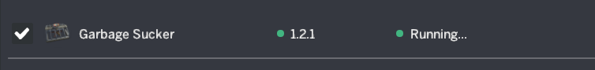

# How to install a mod

Let's get started with the first step!

## 1. Installing the mod loader

If you haven't done it already, install RaftModloader. Please review our guide on that topic for in-detail explanations.



## 2. Finding mods

To search and find mods of your choice, we highly recommend using our [mods directory](https://www.raftmodding.com/mods). Scroll through the page and click on the mod you would like to check out. Alternatively, you can find a list of the most popular mods on our [home page](https://www.raftmodding.com/).

## 3. Installing the mod

On a mod's page you can find all information about a mod. To install a mod, simply press the big green `Install mod` button.

Your browser might ask you if it's okay that raftmodding.com opens the Raft Mod Loader to install a mod. Click `Open` to allow it. If nothing happens after you click the green `Install mod` button, check out the following guide:



## 4. Allowing the mod installation

Now, the Raft Mod Installer should open. It will show you the mod that is about to be installed and ask you once again, if you want to do so. Click `Yes, Install It` to allow the installation.

## 5. Loading the mod

We're already done with installing the mod! Let's see how to load it in the game. Start the game by using the launcher and clicking on the **play** button. When the game has loaded go to the **Mod Manager** tab and if the mod has **load** button click on it as shown below. You will have to click `Load Mod` every time you start Raft.

If the mod you downloaded doesn't have a **load** button but has a **blue button** as shown below its a **Permanent Mod**, That means that its loaded by default and you don't have to deal with it.

## 6. Done?

If everything has worked out, the mod status should be green and the text should say **RUNNING...** as shown below.

**And here you go! Your first mod is now installed and working! You can now enjoy playing raft with great mods such as** [**MoreStorages**](https://www.raftmodding.com/mods/morestorages)**,** [**GarbageSucker**](https://www.raftmodding.com/mods/garbagesucker)**,** [**ItemSpawner**](https://www.raftmodding.com/mods/itemspawner)**,** [**WaterWheel**](https://www.raftmodding.com/mods/waterwheel) **and** [**many more**](https://www.raftmodding.com/mods)**!**

## **Troubleshooting**

Oh no, is anything not working as expected? Make sure to join our [Discord server](https://raftmodding.com/discord) and we will be happy to help you.

