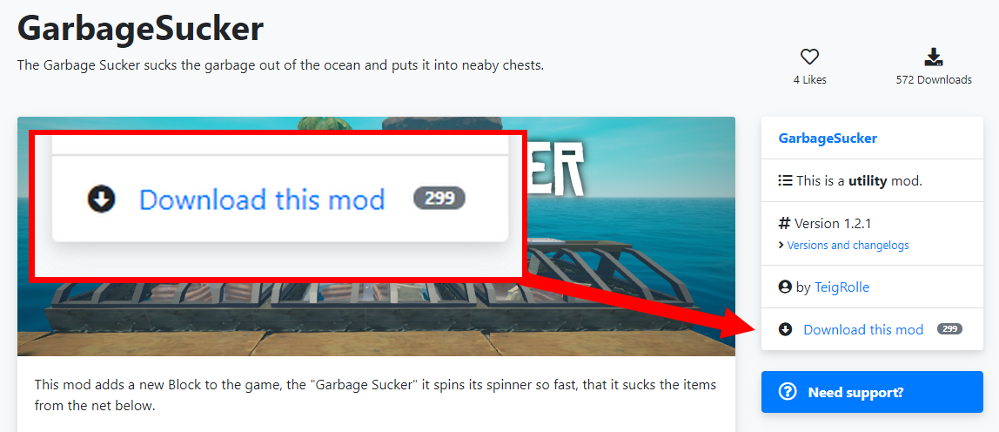

# Alternative mod installation methods

We'll assume that you have already [installed the mod loader](../how-to-install-raftmodloader/) and that you have found a mod in our [mods directory](https://raftmodding.com/mods) that you want to install.

### 1. Downloading the mod

On a mod's page you can find all information about a mod. Since you can't use the mod installation protocol, click on `Download this mod` to download the latest version of it. Your browser will download a `.rmod` file - that's the file format of all Raft mods.

### 2. Installing the mod

You can start the mod installer by opening the downloaded `.rmod` file. This should bring up the mod installer window as shown below:

You can now continue with [**step 4**](./#4-allowing-the-mod-installation) of the main mod installation tutorial:



