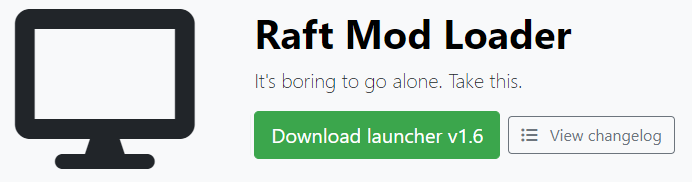

# How to install RaftModLoader

Let's get started with the first step!

### 1. Downloading the Launcher

First, download the latest version of our launcher [here](https://www.raftmodding.com/download). Then place it where ever you want, but we recommend you keep it on your desktop, or somewhere easy to use.

### 2. Terms of Service

Start the launcher by opening the file you downloaded. On first launch you will be prompted to accept our Terms of Service, which is necessary for using our software. By pressing "Agree", you confirm that you accept them. If you have any questions regarding you data privacy, please feel free to contact us via [Discord](https://raftmodding.com/discord) or via [E-Mail](https://www.raftmodding.com/contact).

### 3. Installation

After accepting the terms of service the launcher will download and install all the required files as shown below. You don't need to do anything here, just wait. It can be pretty fast as its less than 5 MB.

### 4. Launching modded Raft

And finally, once the launcher has downloaded and installed all required files, a **`Play`** button will appear as shown below. To start the mod loader, press the **`Play`** button and the game will start. Each time you want to play with mods you have to start the launcher and click on **`Play`**.

### 5. Inside the game

Then once the game has loaded you should have a new menu in the Raft main menu as shown below. If the new menu does not show up in-game, take a look at our troubleshooting guide:



### **6. Next steps**

Congratulations! If you made it this far, you have successfully installed RaftModLoader! Now you might want to install some actual mods. Click the next links for our guide on installing mods:



If something isn't working as expected, maybe take a look at our troubleshooting guide:



**And here you go! RaftModLoader is now installed! You can now enjoy playing raft with great mods!**

