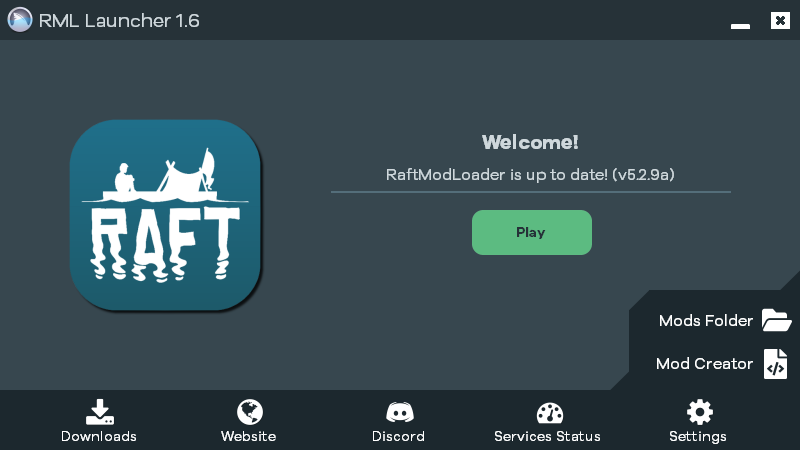
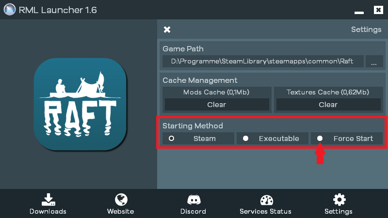
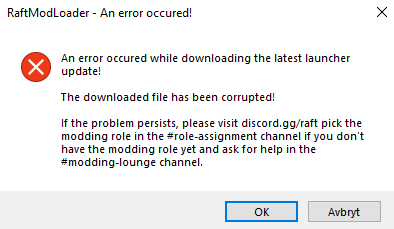

# Troubleshooting

If installing the mod loader is not working as expected, don't worry. Please take a look at the following document which describes some of the more common issues with installing the mod loader. If none of this works, please join our [Discord server](https://raftmodding.com/discord) or contact us via [E-Mail](https://raftmodding.com/contact) and we will be happy to help you!

## What's wrong?

First of all, we need to find out what's the problem. Which of the following descriptions describes your problem best? If an error popped up, try to find the headline with the text describing the error.

* [The menu inside the game does not show up](https://api.raftmodding.com/tutorials/how-to-install-raftmodloader/troubleshooting#menu-not-showing-up)
* [I'm getting a CA3 error](https://api.raftmodding.com/tutorials/how-to-install-raftmodloader/troubleshooting#ca-3-dxa)
* [I'm getting a DXA Rendering issue](https://api.raftmodding.com/tutorials/how-to-install-raftmodloader/troubleshooting#ca-3-dxa)
* ['The downloaded file has been corrupted'](https://api.raftmodding.com/tutorials/how-to-install-raftmodloader/troubleshooting#corrupted)
* [Other / My problem could not be solved with this guide](https://api.raftmodding.com/tutorials/how-to-install-raftmodloader/troubleshooting#other)

## 'The menu inside the game does not show up' 

This is a fairly common issue so don't worry. Please do the following steps:

#### 1. Open the launcher

Close Raft if it is still running and open the launcher application.

#### 2. Open the settings

Click on Settings⚙icon to open the Launcher settings.

#### 3. Change the starting method

In the settings, there is an option for changing the starting method. You can choose betweeen `Steam`, `Executable` and `Force Start`. If you have never changed this before, the current value should be `Steam`. **Please select `Force Start`.**

#### **4. Start the game**

Now, close the Settings by clicking the gear ⚙ again and press `Play` to start the game.

#### 5. Did it work?

If this worked, you should now see the modding menu inside the game. If you can not see the grey menu as shown below, please go back to step 3 and try to change the Starting Method to `Executable`.

## 'I'm getting a CA3 error' or 'DXA Rendering Issues' 

This is a problem with Raft itself, which unfortunately requires manual action. Please visit the official [Raft Discord server](https://discord.gg/raft) and send @ModMail a message. A moderator will take a look at your problem.

## 'The downloaded file has been corrupted' 

This issue is related to our [Launcher](https://www.raftmodding.com/download) trying to download necessary files but failing to do so. Reasons for this might be one of the following:

* Your internet connection or our server has had a small failure.
* Your antivirus program had a false alarm on this download or on our application in general.

#### Solution for 'The downloaded file has been corrupted':

In the following, we will **verify the files' integrity**. This is a Steam tool that allows checks and repairs broken game files.

1. Open Steam and open the _Library_ tab.
2. Right-click _Raft_ and select _Properties_ in the pop-up-menu.
3. In the menu, select the _Local files_ tab.
4. Click on the _Verify integrity of game files_ button.
5. If the tool finds any broken files, it will automatically repair them.
6. Once done, you can close the windows.
7. Now, try to open the Launcher again.
8. Does it work now? If the error keeps coming up, this might be related to your Antivirus program. 

_For visual guidance, check out the_ [_Steam Support article_](https://support.steampowered.com/kb_article.php?ref=2037-QEUH-3335) _about this topic._


If you can't solve this problem with this guide, make sure to [contact us](https://api.raftmodding.com/tutorials/how-to-install-raftmodloader/troubleshooting#other) and we'll be happy to help you.


## Other / My problem could not be solved with this guide 

It seems like your problem is a bit uncommon. But don't worry, we'll be happy to provide personal support on our [Discord server](https://raftmodding.com/discord) or via [E-Mail](https://raftmodding.com/contact).

