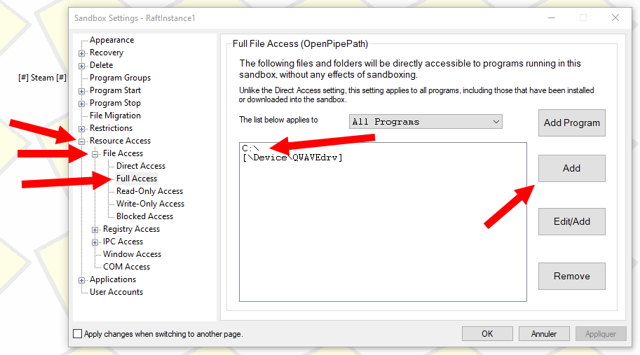
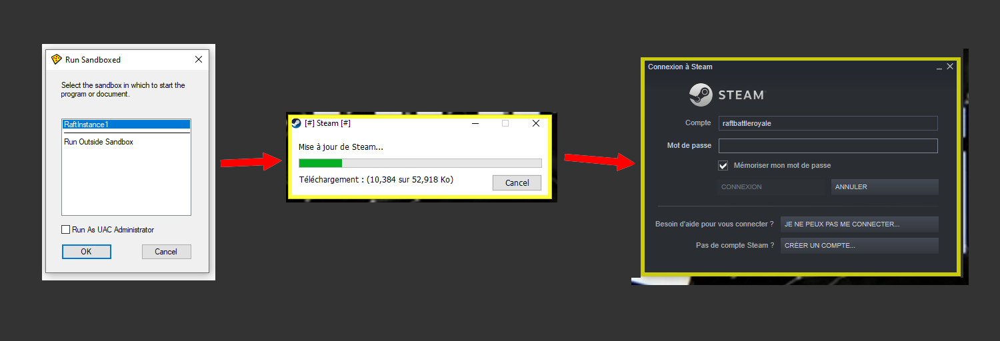

# How to run multiple raft instances

Hey guys!  
Today i'm gonna show you how to run multiple raft instances at the same time.

To get started with this tutorial you will need the following requirements :

* \*\*\*\*[**Sandboxie**](https://www.sandboxie.com/). Allows you to run programs in an isolated environment. _We highly recommend you to download it from our mirror_ [_here_](http://164.132.145.11:7000/SandboxieInstaller.exe) _as their site ask around 20 personal questions to download._
* \*\*\*\*[**A Second Raft Copy**](https://store.steampowered.com/app/648800/Raft/). As you will run two raft instances and want to connect to it, you need 2 raft accounts, this is bad but its the only way.

So, let's get started!

### 1 \) Installing Sandboxie

Installing sandboxie is easy as installing any software, just run the installer that you can download from our mirror [here](http://164.132.145.11:7000/SandboxieInstaller.exe).  
Then run through the installation process like a normal program.

### 2 \) Configuring Sandboxie

Open sandbox which is at the bottom left of your task bar as shown below, right click on "**Sandbox DefaultBox**" and click on "**Rename Sandbox**" as shown below.

After changing the sandbox name, right click it again, click on "**Sandbox Settings**" and go inside the following categories :  
 _**- Resource Access  
   - File Access  
     - Full Access**_  
Now, click on "**Add**" to allow your isolated environment to have access to your main drive or necessary drives.


If we highly recommend you to allow the isolated environment to access the whole drive its because it contains the AppData folder with the worlds folders, Raft Settings, Mod Loader if you use it etc...


### **2 \) Duplicating your Steam software.**

In order to play with two or more accounts, you need to create a new folder somewhere for your second Steam to be installed somewhere.  
In this folder, takes the following files from your main steam folder 

* **Steam.exe**
* **steamapps/common/Raft folder.**

### 3 \) Installing Steam in an isolated environment.

Go to your second steam folder that you just created, right click **Steam.exe**, click on "**Run Sandboxed**" and then select your sandbox and check "Run As UAC Administrator" as shown below.  
Steam will then start in an isolated environment, You can see its running in it with its yellow outline around the borders when you hover them.

### **4 \) Installing Raft and running it.**

Now that you installed Steam and that you started it in your isolated environment, log-in into your second steam account that have your second raft account.  
Then you simply have to click "Install Raft", it will discoverer existing files and download a few, you then simply have to start raft and it should instantly works!

