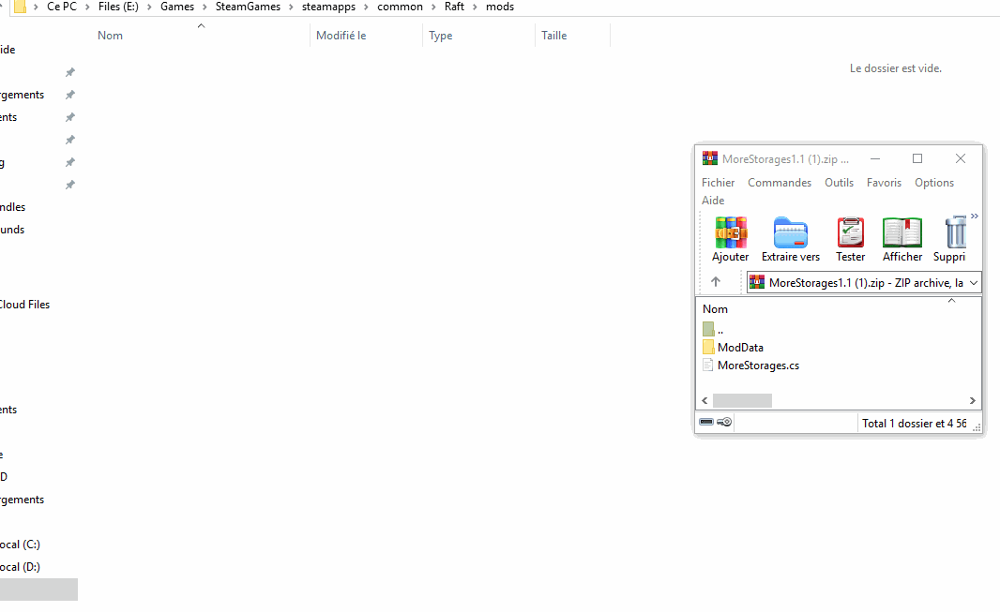

# Mods with multiple files

If your mods relies on assets or configuration files, you will most likely want to include them in the download of your mod.

### Structuring your ZIP the right way

1. Create a ZIP file with a meaningful name, i.e. `WaterWheel.zip` for the WaterWheel mod.
2. Throw your mod's `.cs` file into the root folder of your ZIP \(the code file should have a meaningful name too, of course\)
3. Create a `ModData` folder at the root level of your ZIP
4. Create a `ModName` folder inside the `ModData` folder in your ZIP \(whereas `ModName` is replaced with the actual name of your mod\)
5. Copy your mod's assets and default configuration files to the `ModData/ModName` directory in your ZIP file.

The structure of your ZIP file should now be similar to this:

```text
ModName.zip
├── ModName.cs
└── ModData/
    └── ModName/
        ├── ModName.assets
        ├── config.json
        └── ...
```

### Why you should stick to this structure

We've seen a lot of users having trouble with putting mods to the right folder and extracting zipped mods only adds to this. Using the proposed structure has basically two advantages:

* This is the standard way. Users will expect your mod to be installable just like any other zipped mod 
* It only takes a few clicks to install a mod \(see below\)




